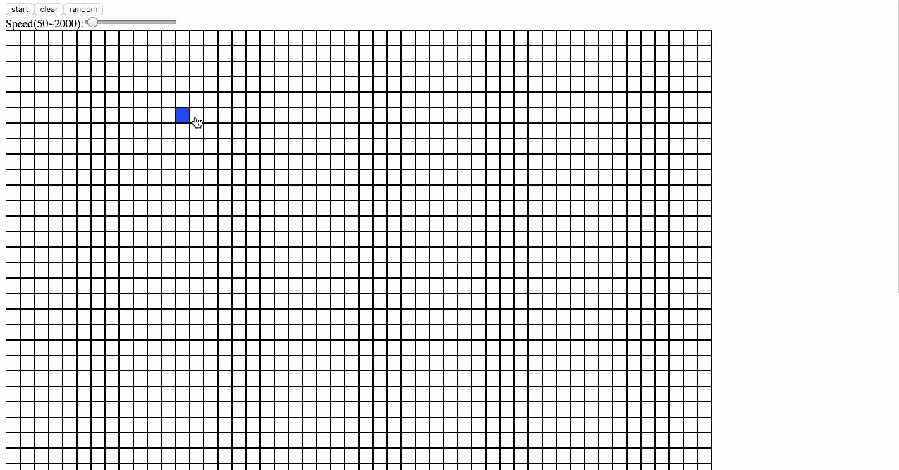

# Game of Life

Conway's Game of Life using react

预览: [https://hacker0limbo.github.io/game-of-life/](https://hacker0limbo.github.io/game-of-life/)

## 规则
根据[wiki](https://en.wikipedia.org/wiki/Conway%27s_Game_of_Life)上的说明, 如下:
- 任何处于存活状态的 cell, 如果周围存在 `2 或者 3` 个 neighbors(活着的 cell), 那么该 cell 继续生存
- 任何处于死亡状态的 cell, 如果周围存在 `3` 个 neghbours(活着的 cell), 那么改 cell 状态变成存活状态
- 其余情况下, 处于存活状态的 cell 下一阶段变成死亡状态. 类似的, 处于死亡状态的 cell 下一阶段仍旧处于死亡状态